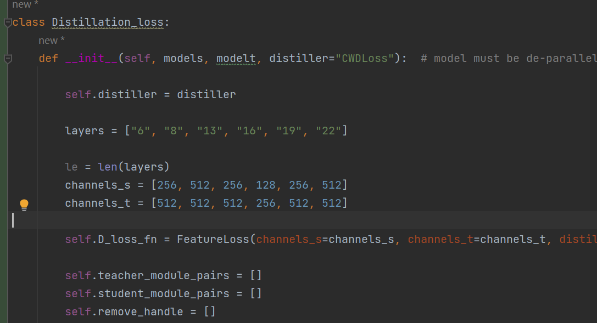

# YOLOV10的知识蒸馏 支持mgd和cwd

1. 使用

```


    model_s = YOLOv10('yolov10s.pt')#教师模型


    model_l = YOLOv10("yolov10l.pt")#学生模型


    model_s.train(data="coco128.yaml", distillation=model_l, Distillation_loss="cwd",amp=False )


```

2.自定义更改通道



自定义更改通道